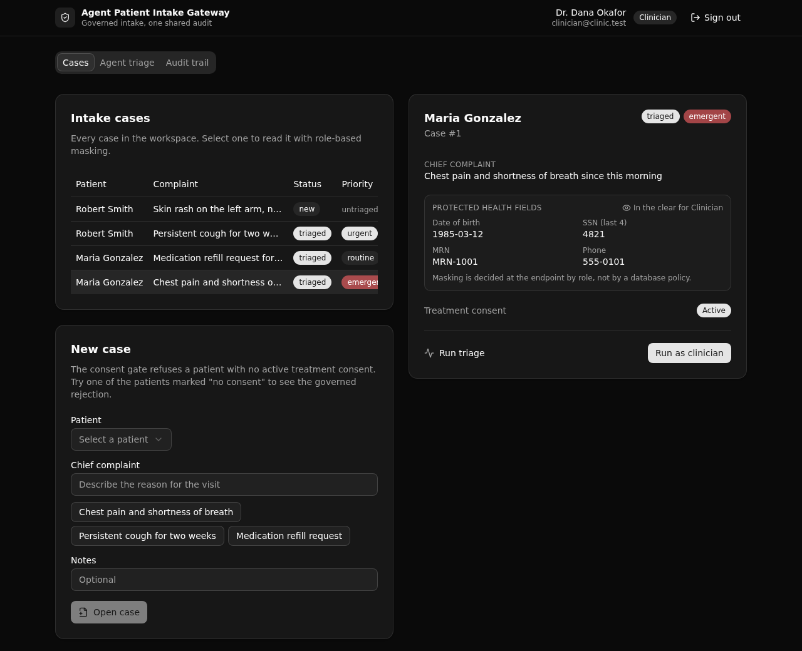

# Agent Patient Intake Gateway

One governed patient-intake API that a human coordinator, a clinician, and an AI agent all call through the same permissioned, logged endpoints. Consent checks, PHI masking, and triage rules hold the same for a person and an agent, and every access lands in one shared audit trail.

**Play 4 (Agent Intelligence Layer), healthcare.** Built with [XanoTS](https://xano.com) (`@xanots/sdk`): a typed Xano backend plus a React frontend that derives its request paths and types from the backend defs.

**6 tables · 10 APIs · 1 shared function**



## What it demonstrates

The point is control, not speed. An agent that triages intake is useful only if it is held to the same rules a person is. This backend proves that with one design choice: the human triage endpoint and the agent triage endpoint call the **same** shared function. The rule evaluation, the case update, and the audit row are identical. The only thing that differs on the wire is the logged actor type.

An enterprise architect can read the endpoints and confirm four governed rules, in one place:

- **Active consent required.** A case create or update is refused unless the patient holds an active, unexpired treatment consent.
- **PHI masking by role.** A clinician reads date of birth and SSN in the clear. A coordinator and the agent service read them masked. The decision is made at the endpoint, from the caller's role.
- **Rule-driven triage.** The active rule set decides a case's priority. The most severe matching rule wins.
- **One shared audit trail.** Every read, create, update, and triage writes a row, for a person and for the agent alike.

Auth is API-layer role-based access control: an auth table, `create_auth_token`, and a role guard on each endpoint. There is no row-level security anywhere. PHI masking is applied per request in the endpoint, not by a database policy.

## Repo layout

```
xano/
  index.ts                 registers the workspace
  tables/                  users, patients, intake_cases, consents, triage_rules, access_log
  api/intake.ts            the API group (canonical slug "intake")
  api/*.ts                 the 10 endpoints
  functions/run-triage.ts  the shared triage engine both triage endpoints call
frontend/
  src/lib/api.ts           the one contract: paths and types derived from the query defs
  src/components/          the five screens
docs/index.html            the landing page (GitHub Pages)
```

## API surface

All endpoints sit under the pinned API group `intake`, so the base path is `/api:intake`.

| Verb | Path | What it enforces |
| --- | --- | --- |
| POST | `/login` | Authenticates a seeded user, mints a role-scoped token. |
| POST | `/seed` | Idempotent demo seed so the app is browsable at once (public). |
| GET | `/cases` | Case summaries with patient names. No PHI, no audit row. |
| GET | `/cases/{case_id}` | Reads one case. Masks PHI by role and logs the read with the masked flag. |
| POST | `/cases` | Creates a case. Role guard (coordinator or clinician) plus the treatment-consent gate. |
| POST | `/cases/update` | Updates a case. Same guards, re-checks required fields. |
| POST | `/cases/triage` | Human triage (clinician). Calls the shared engine, actor type human. |
| POST | `/agent/triage` | Agent triage (agent service). Calls the same engine, actor type agent. |
| GET | `/access-log` | The shared audit trail, filterable by case and by actor type. |
| GET | `/patients` | A non-PHI patient picker plus the ids with an active consent. |

## The frontend

Five screens, styled with Tailwind and shadcn/ui, dark theme:

- **Role sign-in.** Sign in as coordinator, clinician, or agent service. The role drives what the rest of the app can see and do.
- **Case list and create.** Every case with its status and priority. The create form shows the governed rejection when a patient has no active consent.
- **Case detail.** The patient's PHI, masked or in the clear by role, the consent status, and a run-triage button that shows the rule that fired.
- **Agent triage.** Run the same case as the agent service and as a clinician, side by side. The priority and the rule match. Only the logged actor type differs.
- **Audit trail.** One shared log with human and agent rows together, and the masked flag on each read.

The frontend never hand-types a URL or a request body. It reads `getPath()`, `InferInput`, and `InferResponse` from the query defs, so a change to a def flows through to the client.

## Quick start

You need Node 20 or newer and a free [Xano](https://xano.com) account.

```bash
git clone https://github.com/xano-scratch/agent-patient-intake-gateway
cd agent-patient-intake-gateway
npm install
npx xanots login          # one-time browser auth with your Xano account
npm run xano:deploy       # builds the frontend, deploys the backend, prints the live URL
```

`npm run xano:deploy` ships the backend and the built frontend to a live ephemeral environment and prints its URL. Open the URL, and the app seeds itself on first load, so there is data to browse right away.

Demo accounts (all use the password `password123`):

| Email | Role |
| --- | --- |
| `coordinator@clinic.test` | Coordinator |
| `clinician@clinic.test` | Clinician |
| `agent@clinic.test` | Agent service |

Other useful commands:

```bash
npm run typecheck    # tsc --noEmit
npm run build        # build the frontend into frontend/dist
npm run xano:export  # compile the backend to workspace.json and write xano/xano.lock
```

## FAQ

**Is this row-level security?** No. Permissions are checked at the API layer with role guards, and PHI masking is applied in the endpoint by role. Xano's auth model is middleware and role-based access control, not row-level security.

**Does the agent use an LLM?** Not here. The spec allows an optional model-backed showcase, but the governance proof is that the agent path is identical to the human path, so a deterministic rule engine keeps that proof exact. The agent still authenticates with its own role token and is held to the same guards and the same audit.

**Is the seed data real?** No. The patients, consents, and accounts are made up for the demo. Never treat this scratch app as a production reference.

**How is the agent held to the same rules?** Both triage endpoints call one shared function, `run_triage`. The role guard sits on each endpoint, and the shared function does the rule evaluation and the audit, so the two paths cannot drift apart.

## License

MIT
